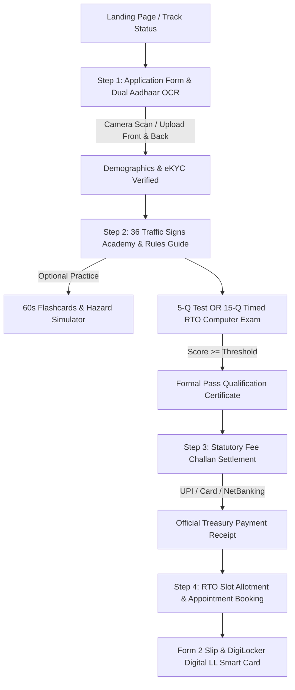

# Sarathi Parivahan (सारथी परिवहन) — Digital Learner's License Portal

[](https://github.com/Navneet-55/sarathi-lite/releases/tag/v1.4)
[](https://sarathi-lite.vercel.app)
[](LICENSE)
[](https://sarathi-lite.vercel.app)
[](https://sarathi-lite.vercel.app)

An authentic, accessible, high-performance digital public service web portal simulating the official end-to-end **Learner's Driving License (LL)** issuance workflow under the **Motor Vehicles Act, 1988** and **Central Motor Vehicles Rules (CMVR), 1989**.

**Author**: [**Navneet**](https://github.com/Navneet-55)  
**Production URL**: [**https://sarathi-lite.vercel.app**](https://sarathi-lite.vercel.app)

---

## 🌟 Key Highlights & Core Capabilities

### 1. 🤖 Sarathi Mitra (सारथी मित्र) — AI Road Safety & Licensing Assistant
- **Floating Interactive Advisor**: Integrated in the corner to assist citizens across all licensing stages.
- **Multilingual Legal Knowledge Base**: Answers questions on MV Act rules, license validity periods, companion driver obligations (Rule 3 CMVR), traffic violation penalties, and required test-day documents in **6 Indian languages**.
- **1-Click Quick FAQs**: Instant answers for common citizen inquiries.

### 2. 📸 Dual Front/Back Aadhaar OCR & Live Camera Scanner
- **Dual-Side Separate Document Extraction**: Scans Front and Back pages of Aadhaar cards independently.
- **Live In-Browser Camera Capture**: Built-in webcam/mobile camera scanner with an on-screen card alignment viewfinder frame.
- **Multi-Tier OCR Pipeline**: Client-side **Tesseract.js (WebAssembly)** combined with **GPT-4o-mini Vision** fallback for automated character recognition of Name, Date of Birth, Mobile, 12-Digit UID, and Residential Address.

### 3. 💳 DigiLocker / mParivahan Simulated Digital LL Smart Card (Form 3)
- **Authentic Smart Card Layout**: Styled like the official MoRTH digital driving license with microchip graphic, scannable QR code, security watermark, vehicle category endorsements, validity dates, blood group, and organ donor badge.
- **Official Form 2 Slip Generation**: Instant printable and downloadable **Form 2 Acknowledgment & Examination Hall Ticket**.

### 4. 🔍 Application Status & Multi-Stage Lifecycle Tracker
- **Real-Time Stage Timeline**: Enter any Application ID (e.g. `KA-2026-LL-84920`) from the header or landing page to track the 5-stage lifecycle:
  1. *Form 2 Application Registration*
  2. *Aadhaar eKYC Document Verification*
  3. *Road Traffic Rules Qualifying Test*
  4. *Treasury Fee Challan Settlement*
  5. *RTO Workstation Slot Allotment & Hall Ticket*

### 5. 🚦 Complete 36 IRC:67 Traffic Sign Academy & Training Tools
- **Statutory 36-Sign Curriculum**: Organized in official statutory order across:
  - **Mandatory / Regulatory Signs (M-01 to M-17)** (Octagonal STOP, Inverted GIVE WAY, No Entry, Speed Limits, Overtaking Prohibitions, Silence Zones)
  - **Cautionary / Warning Signs (C-01 to C-16)** (Pedestrian Crossing, School Zone, Hairpin Bends, Steep Gradients, Narrow Bridges, Level Crossings)
  - **Informatory Signs (I-01 to I-03)** (First Aid, Hospital, Fuel Station)
- **⚡ 60-Second Rapid-Fire Flashcards**: Interactive speed-round recognition game with countdown timer, streak multiplier, and score summary.
- **🛡️ Hazard Perception Simulator**: Situational Indian road hazard scenarios (emergency ambulance priority, high-beam night etiquette, mountain ghat right-of-way, and monsoon aquaplaning).

### 6. 🎓 5-Q Quick Test & Official 15-Q Timed RTO Computer Exam Simulation
- **Dual Examination Modes**:
  - **Quick 5-Question Test** (3/5 pass score) for fast verification.
  - **Official 15-Question Timed RTO Simulation** (9/15 pass threshold) mimicking the actual computerized test at RTO centers.
- **Formal Pass Qualification Certificate**: Automatically generates an official verifiable **Learner's License Qualification Certificate** with citizen credentials, score, RTO seal, and 1-click print.

### 7. 🚗 Vehicle Class Multi-Selector & Dynamic Fee Calculation
- **Multi-Category Endorsement (COV)**:
  - 🛵 **MCWOG** (Motorcycle Without Gear / Scooter <50cc)
  - 🏍️ **MCWG** (Motorcycle With Gear)
  - 🚗 **LMV** (Light Motor Vehicle — Car/Jeep/Van)
  - 🛺 **3W-NT** (3-Wheeler Non-Transport Auto)
- **Dynamic Challan Computation**: Automatically computes and breaks down statutory government fees (₹150 per class) with itemized treasury accounting head `0041-00-102`.

### 8. 🩸 Medical Profile & Organ Donor Consent (Section 134A)
- Citizen Blood Group selection (`A+`, `B+`, `O+`, `AB+`, etc.) and voluntary **Organ Donor Pledge** integrated into the legal profile and printed directly onto the Digital Smart Card.

### 9. 🌐 6 Indian Languages (100% Pure Separation)
- Full localization with zero mixed text across:
  - **English**
  - **हिन्दी (Hindi)**
  - **ಕನ್ನಡ (Kannada)**
  - **मराठी (Marathi)**
  - **தமிழ் (Tamil)**
  - **తెలుగు (Telugu)**
- **Native Web Speech Synthesis (`SpeechSynthesisUtterance`)**: Audio question narration in all 6 regional languages.

### 10. 📱 PWA & Offline Road Safety Handbook
- **Installable Progressive Web App (PWA)** with `manifest.json` and network-first **Service Worker (`sw.js`)** caching, enabling learners in rural or low-connectivity RTO areas to study traffic signs and driving rules offline.

---

## 🏛️ End-to-End Citizen Application Workflow



---

## 💻 Tech Stack

| Layer | Technologies |
|---|---|
| **Frontend Framework** | React 18.3, Vite 5.4 |
| **Styling & Design System** | Tailwind CSS 3.4, Custom GIGW Accessibility Themes, Dark Mode |
| **Optical Character Recognition** | Tesseract.js (WebAssembly) + OpenAI GPT-4o-mini Vision API |
| **Audio Narration** | Web Speech Synthesis API (`en-IN`, `hi-IN`, `kn-IN`, `mr-IN`, `ta-IN`, `te-IN`) |
| **Offline Caching & PWA** | Progressive Web App Manifest + Service Worker Cache API |
| **Analytics & Hosting** | Vercel Serverless Edge Platform + Vercel Web Analytics |
| **Linting & Code Quality** | ESLint 9 (0 errors, 0 warnings), Prettier |

---

## 🚀 Local Development Setup

### Prerequisites
- **Node.js**: v18.0.0 or higher
- **npm**: v9.0.0 or higher

### Steps

```bash
# 1. Clone the repository
git clone https://github.com/Navneet-55/sarathi-lite.git
cd sarathi-lite

# 2. Install dependencies
npm install

# 3. Start local development server
npm run dev
```

Visit [`http://localhost:5173`](http://localhost:5173) in your browser.

---

## 🧪 Verification & Build

```bash
# Run linting verification (ESLint 9)
npm run lint

# Build optimized production bundle
npm run build

# Preview production build locally
npm run preview
```

---

## 📜 Statutory Standards & Compliance

This portal is architected in accordance with statutory guidelines:
- **Motor Vehicles Act, 1988** (Sections 14, 112, 115, 119, 122, 130, 131, 134A, 184, 185, 194)
- **Central Motor Vehicles Rules, 1989** (Rules 3, 9, 10, 11, 12, 14, 15, 17, 18, 27, 32)
- **Indian Roads Congress Standard IRC:67** (Code of Practice for Road Signs)
- **Guidelines for Indian Government Websites (GIGW 3.0)** (Accessibility, high-contrast, scalable typography, pure language localization)

---

## 📄 License

Distributed under the **MIT License**. See `LICENSE` for more information.

Developed with precision by **[Navneet](https://github.com/Navneet-55)**.
